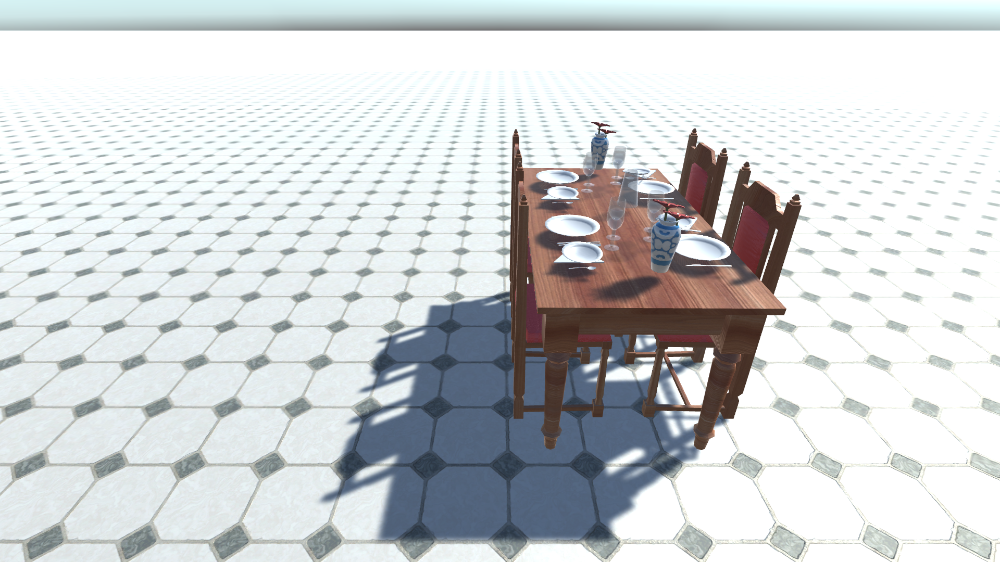

# vggToDepth
A CNN that estimate depth from single RGB photo

This project is built based on a VGG19 net, with uppool layers that mirrors VGG19 network and forward feeding path.

Figure 1. Input to the neural network

Figure 2, Output from the neural network